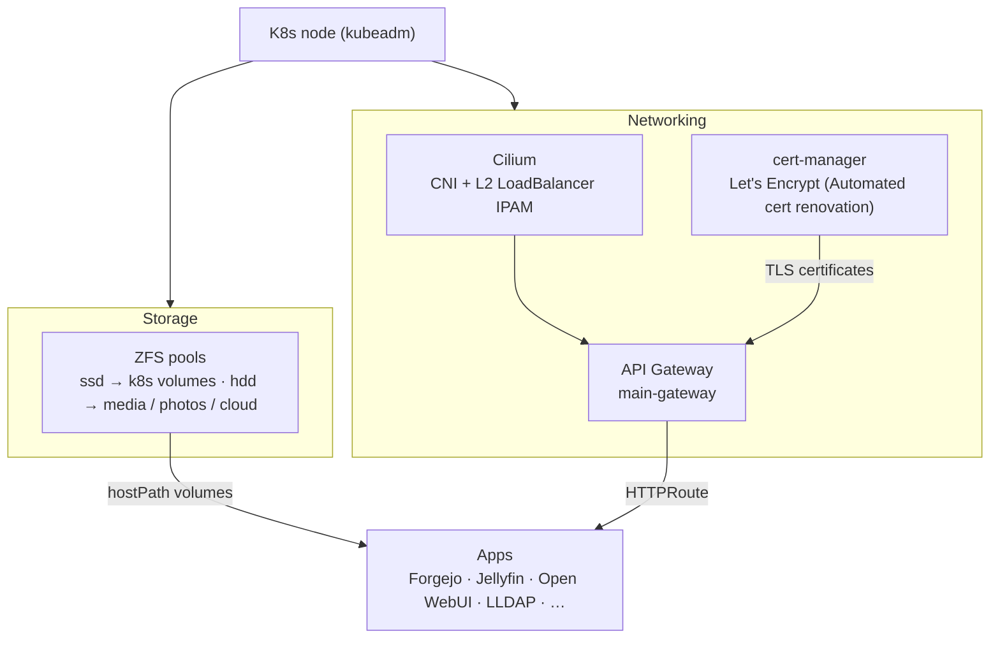

# home-platform

My personal infrastructure and application platform, managed with GitOps.

## Description

This is my homelab-platform, running on bare metal and managed the same way I'd manage
anything in production: everything in Git, applied by Flux, nothing changed by hand
on the cluster. One box, one Kubernetes node, one repo that describes the whole
thing end to end — storage, networking, certificates, and the apps I actually use
day to day.

Made with love for my family, friends and me. This tries to be a place for learning, automate
and enjoy the benefits of technology self hosted like privacy, cost optimization, edge computing 
and extra benefits.

## Diagram overview

Everything runs on a single node. ZFS gives the pods their storage, Cilium handles
pod networking and hands out the LoadBalancer IP, cert-manager keeps every
listener on the Gateway issued and renewed, and the Gateway routes each hostname
to its app. Flux watches this repo and reconciles the cluster to match it.

## Guides

| Guide | What it covers |
|---|---|
| [k8s-setup.md](docs/guides/k8s-setup.md) | Base Kubernetes install with kubeadm |
| [disk-mirror-zfs.md](docs/guides/disk-mirror-zfs.md) | ZFS vs mdadm, pool/dataset layout, ARC tuning for Kubernetes |
| [k8s-cilium.md](docs/guides/k8s-cilium.md) | Cilium install/upgrade flags and the Gateway API |
| [k8s-cert-manager.md](docs/guides/k8s-cert-manager.md) | How gateway-shim and HTTP-01 issue TLS certs for the Gateway, adding a new host |
| [k8s-flux-operator.md](docs/guides/k8s-flux-operator.md) | Bootstrapping the Flux Operator and wiring this repo up for GitOps |

