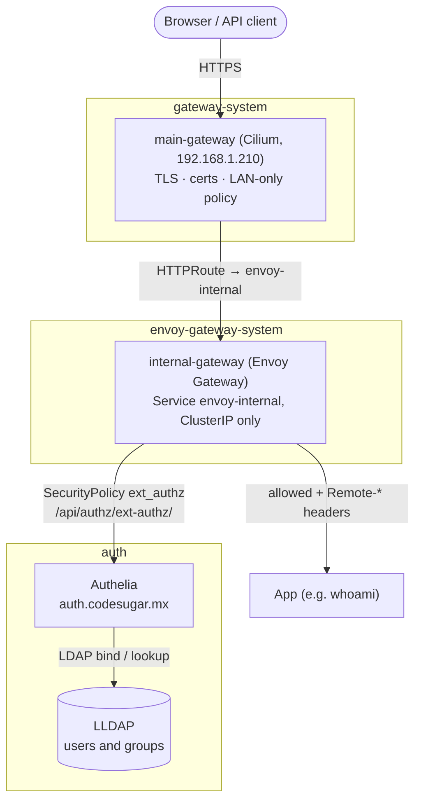
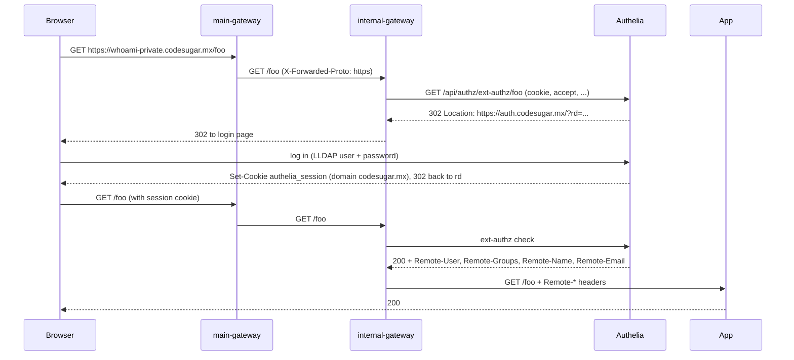

# Authentication

Single sign-on in front of any app behind the Gateway: Authelia checks every request,
LLDAP holds the users, and Envoy Gateway enforces the decision. The apps themselves
need no auth code. They receive the logged-in user as request headers.

## How it works



Protection is added per app, as two tiers in front of it:

1. **main-gateway (Cilium)** stays the only entry point. It terminates TLS, holds the
   cert-manager certificates, and applies `lan-only-policy`. For a protected host its
   `HTTPRoute` does not point at the app. It points at the `envoy-internal` Service.
2. **internal-gateway (Envoy Gateway)** has a second `HTTPRoute` for the same hostname,
   and a `SecurityPolicy` on that route. Before each request reaches the app, Envoy asks
   Authelia and passes the request on only if Authelia allows it.

### Why two gateways

Authelia's [Envoy Gateway integration](https://www.authelia.com/integration/kubernetes/envoy/gateway/)
is a `SecurityPolicy`. That resource belongs to Envoy Gateway's controller
(`gateway.envoyproxy.io`). Cilium also runs Envoy, but it generates that Envoy's
config itself and has no HTTPRoute filter for external auth, so a `SecurityPolicy`
attached to a Cilium route would be accepted by the API server and ignored.

Envoy Gateway runs here as an internal, ClusterIP-only tier, not as a second public
gateway. That keeps one LoadBalancer IP, one router port forward, one set of
certificates, and one network policy.

## The login flow

### Browser



The session cookie is set on `codesugar.mx`, so one login covers every protected
subdomain.

### API clients (basic auth)

Clients that can't follow a login page, like curl or scripts, send credentials on every
request:

```bash
curl -u alice:password https://whoami-private.codesugar.mx/
```

Authelia's ext-authz endpoint accepts `Authorization: Basic` by default and checks it
against LLDAP directly, with no session involved.

| Request | Response |
|---|---|
| No session, `Accept: text/html` | `302` to `auth.codesugar.mx/?rd=<original URL>` |
| Wrong basic-auth password | `401` |
| Valid session or basic auth | `200` from the app, with `Remote-*` headers added |
| Authelia unreachable | `403` (`failOpen: false`: access is denied, never let through) |

## Components

| Component | Where | Role |
|---|---|---|
| LLDAP | `infrastructure/flux/auth/lldap.yaml` | User and group directory (`dc=codesugar,dc=mx`), admin UI at `lldap.codesugar.mx` |
| Authelia | `infrastructure/flux/auth/authelia.yaml` | Login portal at `auth.codesugar.mx`, session store, authorization decisions |
| Envoy Gateway | `infrastructure/flux/cilium/envoy-gateway/` | Controller, `internal-gateway`, and the Envoy proxy that calls Authelia |
| SecurityPolicy | next to each protected app (e.g. `infrastructure/flux/test/whoami-private.yaml`) | Turns on the Authelia check for one `HTTPRoute` |

## What is configured

### Authelia

`infrastructure/flux/auth/authelia.yaml`. The parts that matter for auth:

```yaml
    authentication_backend:
      ldap:
        implementation: lldap
        address: ldap://lldap.auth.svc.cluster.local:3890
        base_dn: dc=codesugar,dc=mx
        user: uid=authelia,ou=people,dc=codesugar,dc=mx
    access_control:
      default_policy: two_factor
      rules:
      - domain: falco.codesugar.mx
        subject: group:ldap-k8s-admin
        policy: two_factor
      - domain: falco.codesugar.mx
        policy: deny
    session:
      cookies:
      - domain: codesugar.mx
        authelia_url: https://auth.codesugar.mx
```

- `default_policy: two_factor` means any LLDAP user with a second factor can reach any
  protected host.
- `access_control.rules` restrict a host to a group. The first matching rule wins, so a
  group rule needs a `deny` rule for the same domain after it. Otherwise users outside
  the group fall through to `default_policy` and get in. `falco.codesugar.mx` is limited
  to `ldap-k8s-admin` this way (see [k8s-falco.md](k8s-falco.md#access-to-the-ui)).
- Authelia reads its config only at startup. After a change to the ConfigMap is
  reconciled, run `kubectl -n auth rollout restart deploy/authelia`.
- The ext-authz endpoint (`/api/authz/ext-authz/`) is one of Authelia's default authz
  endpoints, so it needs no config.
- The pod sets `enableServiceLinks: false`. Otherwise Kubernetes injects
  `AUTHELIA_PORT=tcp://...` and similar variables for the `authelia` Service, and Authelia
  parses them as config keys (`server.port`), which conflicts with `server.address` and
  stops it from starting.

Secrets (`JWT_SECRET`, `SESSION_SECRET`, `STORAGE_ENCRYPTION_KEY`, `LDAP_PASSWORD`) are
created out-of-band in `authelia-secrets`. The comment in the manifest has the command.

### Envoy Gateway

`infrastructure/flux/cilium/envoy-gateway/`:

- **`crds/`**: Envoy Gateway's own CRDs, rendered from `gateway-crds-helm` and committed
  as plain files, the same way `api-gateway/` holds the Gateway API CRDs. They can't come
  from the HelmRelease. The single `home-platform` Kustomization would try to apply
  `EnvoyProxy` and `SecurityPolicy` before a HelmRelease had installed their CRDs, and
  the whole apply would fail. Gateway API CRDs are **not** included; they stay in
  `api-gateway/` (Envoy Gateway v1.9.1 is built against the same v1.6.1).
- **HelmRelease `envoy-gateway`**: the controller, from
  `oci://docker.io/envoyproxy/gateway-helm`, with `crds: Skip`.
- **`EnvoyProxy/internal`** and **`GatewayClass/envoy-gateway`**: make the proxy Service
  a ClusterIP named `envoy-internal`, so there's a stable name to route to and no
  LoadBalancer IP is taken.
- **`Gateway/internal-gateway`**: one HTTP listener on port 80, routes allowed from all
  namespaces.
- **`ClientTrafficPolicy/trust-main-gateway`**: `numTrustedHops: 1`. Without it Envoy
  treats itself as the edge proxy and rewrites `X-Forwarded-Proto` to `http`. Authelia
  would then build `http://` redirect URLs and see main-gateway's IP instead of the
  client's.
- **`ReferenceGrant/allow-routes-to-envoy-internal`**: lets `HTTPRoute`s in app
  namespaces point at `envoy-internal`. There's one `from` entry per namespace.

### Per app

`infrastructure/flux/test/whoami-private.yaml` is the reference:

```yaml
# 1. main-gateway route: hand the host to Envoy Gateway instead of the app
kind: HTTPRoute
metadata:
  name: whoami-private-ls
spec:
  parentRefs:
  - {group: gateway.networking.k8s.io, kind: ListenerSet, name: whoami-private, sectionName: https}
  hostnames: [whoami-private.codesugar.mx]
  rules:
  - backendRefs:
    - {name: envoy-internal, namespace: envoy-gateway-system, port: 80}
---
# 2. internal-gateway route: same hostname, now to the real app
kind: HTTPRoute
metadata:
  name: whoami-private
spec:
  parentRefs:
  - {name: internal-gateway, namespace: envoy-gateway-system}
  hostnames: [whoami-private.codesugar.mx]
  rules:
  - backendRefs:
    - {name: whoami, port: 80}
---
# 3. the Authelia check on route 2
kind: SecurityPolicy
metadata:
  name: authelia-extauthz
spec:
  targetRefs:
  - {group: gateway.networking.k8s.io, kind: HTTPRoute, name: whoami-private}
  extAuth:
    headersToExtAuth: [accept, cookie, authorization, proxy-authorization, x-forwarded-proto]
    failOpen: false
    http:
      backendRefs:
      - {name: authelia, namespace: auth, port: 9091}
      path: /api/authz/ext-authz/
      headersToBackend: [Remote-User, Remote-Groups, Remote-Name, Remote-Email]
---
# 4. allow the policy to reach the Authelia Service across namespaces
kind: ReferenceGrant
metadata:
  name: test2-securitypolicy-to-authelia
  namespace: auth
spec:
  from:
  - {group: gateway.envoyproxy.io, kind: SecurityPolicy, namespace: test2}
  to:
  - {group: "", kind: Service, name: authelia}
```

## Protecting a new app

For an app `grafana` in namespace `monitoring`:

1. Keep its `ListenerSet` (cert-manager still issues the certificate there, see
   [k8s-cert-manager.md](k8s-cert-manager.md)).
2. Change its `main-gateway` `HTTPRoute` backend to
   `envoy-internal` / `envoy-gateway-system` / port `80`.
3. Add a second `HTTPRoute` with the same hostname, `parentRefs: internal-gateway`,
   and the app's Service as backend.
4. Add a `SecurityPolicy` targeting that second route (copy from `whoami-private.yaml`).
5. Add `namespace: monitoring` as a `from` entry to **both** `ReferenceGrant`s:
   `allow-routes-to-envoy-internal` in `envoy-gateway.yaml`, and a
   `SecurityPolicy → authelia` grant in `auth` (either a new one or extend the existing).
6. If the host is public, i.e. listed in `lan-only-policy`, add `auth.codesugar.mx`
   to that public list as well. Otherwise outside users are redirected to a login page
   they can't reach.

If the app can read `Remote-User` / `Remote-Email` headers (Grafana, Forgejo, Open WebUI
all have a "trusted header" / reverse-proxy auth mode), it can log the user in
automatically. Only enable that when the app is reachable **exclusively** through
`internal-gateway`. Anything that can reach the pod directly can forge those headers.

## OIDC clients

Apps that speak OpenID Connect log in against Authelia directly instead of going through
`internal-gateway`. The provider is configured under `identity_providers.oidc` in
`authelia.yaml`. Its key material lives in `authelia-secrets` and gets into the config two ways:

- `OIDC_HMAC_SECRET` through `AUTHELIA_IDENTITY_PROVIDERS_OIDC_HMAC_SECRET_FILE`.
- `OIDC_JWKS_KEY` and each client's secret digest through `{{ secret "/secrets/..." }}`.
  `X_AUTHELIA_CONFIG_FILTERS=template` enables this. The filter runs over the whole
  config, so any literal `{{` in it would need escaping.

The `id-token-claims` claims policy puts `email`, `groups`, and similar claims into the
ID token. Authelia leaves them out by default and serves them only from userinfo. The
`groups` claim holds LLDAP group names, such as `ldap-k8s-admin`.

### Flux web UI (`flux.codesugar.mx`)

- Client `flux-web`, with redirect `https://flux.codesugar.mx/oauth2/callback`.
- The UI impersonates the user with the ID token's `email` and `groups` claims, so RBAC
  decides what a user can see and do. `ClusterRoleBinding/flux-web-ldap-k8s-admin` in
  `flux-web.yaml` gives the `ldap-k8s-admin` group the chart's `flux-web-admin` role. Bind
  another group to `flux-web-user` for read-only access. A user in no bound group can log
  in but sees nothing.
- The plaintext client secret is in `flux-system/flux-web-client`. The HelmRelease injects
  it with `valuesFrom`.

One-time setup. Create the secrets **before** pushing. Authelia won't start while the
`{{ secret }}` files are missing.

```bash
# HMAC secret, JWKS signing key, and the flux-web client secret (plaintext + digest)
HMAC=$(openssl rand -hex 64)
openssl genrsa -out private.pem 2048
kubectl -n auth exec deploy/authelia -- authelia crypto hash generate pbkdf2 \
  --variant sha512 --random --random.length 72 --random.charset rfc3986
#   -> "Random Password: <plaintext>"  and  "Digest: $pbkdf2-sha512$..."

kubectl -n auth patch secret authelia-secrets --type merge -p "$(jq -n \
  --arg h "$HMAC" --rawfile k private.pem --arg d '<digest>' \
  '{stringData: {OIDC_HMAC_SECRET: $h, OIDC_JWKS_KEY: $k, FLUX_WEB_OIDC_CLIENT_SECRET_DIGEST: $d}}')"
kubectl -n flux-system create secret generic flux-web-client \
  --from-literal=client-secret='<plaintext>'
rm private.pem
```

Check `https://auth.codesugar.mx/.well-known/openid-configuration` to confirm the provider
is up.

## Verifying

```bash
# Envoy Gateway is up and programmed the internal gateway
kubectl -n envoy-gateway-system get pods
kubectl get gatewayclass envoy-gateway                        # ACCEPTED=True
kubectl -n envoy-gateway-system get gateway internal-gateway  # PROGRAMMED=True
kubectl -n envoy-gateway-system get svc envoy-internal        # ClusterIP

# policies accepted
kubectl -n envoy-gateway-system get clienttrafficpolicy trust-main-gateway \
  -o jsonpath='{.status..conditions[*].message}'
kubectl -n test2 get securitypolicy authelia-extauthz \
  -o jsonpath='{.status..conditions[*].message}'              # "Policy has been accepted."

# both routes resolved (Cilium → envoy-internal, Envoy Gateway → app)
kubectl -n test2 get httproute whoami-private-ls whoami-private \
  -o jsonpath='{range .items[*]}{.metadata.name}: {.status..conditions[*].reason}{"\n"}{end}'

# end to end
curl -sI https://whoami-private.codesugar.mx | grep -i location   # → auth.codesugar.mx/?rd=https%3A...
curl -s -u alice:password https://whoami-private.codesugar.mx | grep Remote-
```

## Troubleshooting

```bash
kubectl -n auth logs deploy/authelia -f
kubectl -n envoy-gateway-system logs deploy/envoy-gateway -f
kubectl -n envoy-gateway-system logs -l gateway.envoyproxy.io/owning-gateway-name=internal-gateway -c envoy -f
```

**Every request returns `403`, Envoy log shows `ext_authz_error` / `UAEX`**: Envoy
can't get an answer from Authelia. Check the Authelia pod is running, and that the
`SecurityPolicy` is `Accepted`. `service auth/authelia not found` or a ReferenceGrant
message means the `auth` grant is missing the app's namespace.

**Redirect goes to `http://...` or Authelia logs complain about an insecure scheme**:
`X-Forwarded-Proto` arrived as `http`. The `trust-main-gateway` ClientTrafficPolicy is
missing or not accepted.

**Redirect loop after logging in**: the session cookie isn't being sent back. The
protected host must be under a `session.cookies[].domain` in Authelia (`codesugar.mx`
covers every subdomain), and the page must be HTTPS.

**`main-gateway` returns `500` / route shows `RefNotPermitted`**: the app's namespace
isn't in `allow-routes-to-envoy-internal`.

**Request reaches the app with no `Remote-*` headers**: the request went around
Envoy Gateway. Check the `main-gateway` route points at `envoy-internal`, not at the
app's Service.

**Authelia pod crash-loops with `deprecation mapping for keys 'server.host', 'server.port'`**:
`enableServiceLinks: false` was removed from the Deployment.

## Upgrading Envoy Gateway

The chart and CRDs are versioned together. Bump the `OCIRepository` tag in
`envoy-gateway.yaml` and re-render the CRDs in the same commit:

```bash
helm template x oci://docker.io/envoyproxy/gateway-crds-helm --version vX.Y.Z \
  --set crds.envoyGateway.enabled=true
```

Split the output into `crds/` one file per CRD (the `# Source:` comments give the file
names). Check the release notes for the Gateway API version it supports. It must match
what `api-gateway/` installs.
