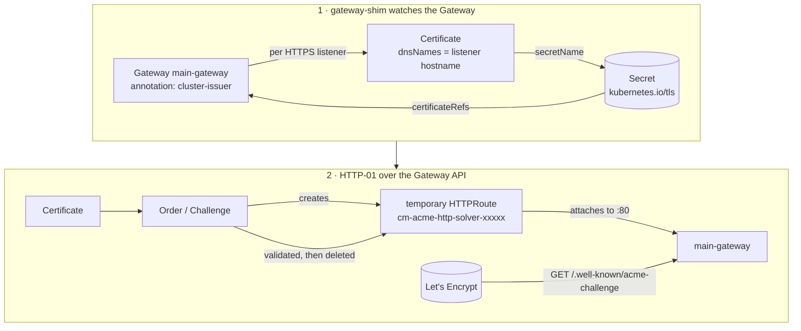

# cert-manager

TLS certificates for everything behind the Cilium Gateway, issued by Let's Encrypt
and renewed without anyone touching a manifest.

## How it works



Two separate mechanisms do the work.

**gateway-shim** is the automatic part. Annotate a `Gateway` with
`cert-manager.io/cluster-issuer` and cert-manager reads its HTTPS listeners: for each
distinct `tls.certificateRefs` secret name it creates and maintains a `Certificate`
whose DNS names are the hostnames of the listeners pointing at that secret. You never
write a `Certificate` by hand, and you never renew one.

The important limit: cert-manager reads **Gateway listeners**, not `HTTPRoute`s. A
hostname that only exists on an `HTTPRoute` gets no certificate. Declaring the listener
is the one manual step per host.

**The HTTP-01 solver** proves ownership. For each challenge cert-manager creates a
throwaway solver pod, service and `HTTPRoute` in the Certificate's namespace, attaches
the route to `main-gateway`'s port 80 listener with the hostname being validated, and
lets Let's Encrypt fetch `/.well-known/acme-challenge/<token>` over plain HTTP. Once the
order is valid the three objects are deleted again.

## Prerequisites

- Public `A` record for every hostname pointing at the WAN IP.
- Router forwarding **80** → `192.168.1.210` (required by HTTP-01) and **443** for real
  traffic.
- Gateway API CRDs installed before cert-manager starts — they already are, in
  `infrastructure/flux/api-gateway/`.

Wildcards are not possible here: ACME refuses HTTP-01 for `*.codesugar.mx`, so a
wildcard SAN would need a DNS-01 solver instead.

## What is configured

### Gateway API support in cert-manager

`infrastructure/flux/cert-manager/helm-release.yaml`:

```yaml
  values:
    config:
      apiVersion: controller.config.cert-manager.io/v1alpha1
      kind: ControllerConfiguration
      gatewayAPI:
        enabled: true
```

`apiVersion` and `kind` are required by the chart. This is the modern spelling — most
blog posts still show `--enable-gateway-api` or the `ExperimentalGatewayAPISupport`
feature gate, both of which are unnecessary since the gate went beta/on-by-default.

No RBAC work is needed: the `cert-manager-controller-challenges` and
`-ingress-shim` ClusterRoles already carry `gateway.networking.k8s.io` rules for
`gateways`, `httproutes` and `listenersets`, unconditionally.

Setting `config` for the first time adds `--config`, a volume and a volumeMount to the
Deployment, so the pod rolls by itself. **Later** edits only rewrite the ConfigMap — the
chart has no `checksum/config` pod annotation — so those need a nudge:

```bash
kubectl -n cert-manager rollout restart deploy/cert-manager
```

### Issuers

`infrastructure/flux/cert-manager/cluster-issuer.yaml` defines `letsencrypt-staging` and
`letsencrypt-prod`, identical apart from the ACME directory URL and account key secret
name. Both solve HTTP-01 through `main-gateway`:

```yaml
    solvers:
    - http01:
        gatewayHTTPRoute:
          parentRefs:
          - name: main-gateway
            namespace: gateway-system
            kind: Gateway
```

The solver `HTTPRoute` is created in the Certificate's namespace and attaches
cross-namespace, which works because the port 80 listener has
`allowedRoutes.namespaces.from: All`.

Always prove a new setup on staging first. Let's Encrypt allows 50 certificates per
registered domain per week and failed orders still count against you.

## Adding a host

Add one listener block to `infrastructure/flux/cilium/gateway.yaml` and commit:

```yaml
  - name: grafana-https
    protocol: HTTPS
    port: 443
    hostname: grafana.codesugar.mx
    tls:
      mode: Terminate
      certificateRefs:
      - kind: Secret
        name: grafana-codesugar-mx-tls
    allowedRoutes:
      namespaces:
        from: All
```

That is the whole job. cert-manager creates `Certificate/grafana-codesugar-mx-tls` in
`gateway-system`, orders the cert, writes the secret, and renews it from then on. The
secret lives in the Gateway's own namespace, so no `ReferenceGrant` is involved.

Give each listener its own secret name. Sharing one secret across listeners merges the
hostnames into a single SAN certificate, which means every new host re-issues the whole
thing; separate names keep the blast radius at one host.

The app's `HTTPRoute` needs a matching `hostnames` entry and **no** `sectionName` — with
`sectionName` it pins to a single listener and TLS traffic 404s. See
`infrastructure/flux/test/nginx.yaml`.

## Verifying

```bash
# cert-manager picked up the config
kubectl -n cert-manager get deploy cert-manager \
  -o jsonpath='{.spec.template.spec.containers[0].args}'   # expect --config=...
kubectl -n cert-manager logs deploy/cert-manager | grep -i gateway

# issuers registered with ACME
kubectl get clusterissuer                                   # READY=True

# the shim turned listeners into Certificates
kubectl -n gateway-system get certificate,certificaterequest,order,challenge

# watch the temporary solver route come and go
kubectl -n gateway-system get httproute -w                  # cm-acme-http-solver-xxxxx

# from OUTSIDE the network, while a challenge is pending
curl -sv http://test.codesugar.mx/.well-known/acme-challenge/anything

# Cilium actually programmed the listeners
kubectl -n gateway-system get gateway main-gateway -o yaml  # Programmed + ResolvedRefs
kubectl get ciliumenvoyconfig -A                            # a CEC must exist

# end to end
curl -vI https://test.codesugar.mx                          # "(STAGING) Let's Encrypt"
```

## Switching staging → prod

Change the annotation on the Gateway to `letsencrypt-prod` and commit. cert-manager
notices the issuer changed but will not discard a still-valid certificate, so force a
fresh order:

```bash
kubectl -n gateway-system delete certificate test-codesugar-mx-tls
kubectl -n gateway-system delete secret test-codesugar-mx-tls
```

The shim recreates the Certificate from the listener within seconds. Re-run the `curl
-vI` check — the issuer should now read `Let's Encrypt` and a browser should trust it.

## Troubleshooting

```bash
# why is a cert stuck?
kubectl -n gateway-system describe certificate <name>
kubectl -n gateway-system describe challenge        # the ACME error is here
kubectl -n cert-manager logs deploy/cert-manager -f
```

**Challenge pending forever** — Let's Encrypt cannot reach port 80. Check the A record
resolves to the WAN IP and the router forwards 80 to `192.168.1.210`; test the solver URL
from outside the LAN, not from a machine that resolves the name internally.

**Listener stuck on `ResolvedRefs: False`** — the secret does not exist yet. Expected
until the first order completes; it resolves on its own.

**Port 80 suddenly 404s after adding an HTTPS listener** — check
`kubectl get ciliumenvoyconfig -A` still shows a CEC for the gateway. Cilium
[#44123](https://github.com/cilium/cilium/issues/44123) had a wildcard-HTTP-listener
plus specific-hostname-HTTPS-listener combination generate no Envoy config at all, which
breaks HTTP-01 exactly. Fixed before 1.20, but this is the topology that triggered it.

**Secret exists but is `Opaque` and cert-manager refuses to write it** — Cilium
[#45705](https://github.com/cilium/cilium/issues/45705), 1.19.3.x only, fixed before
1.20. Not applicable here, noted so it isn't re-diagnosed from scratch.

## Later: per-namespace listeners

Cilium 1.20 and cert-manager 1.21 both support `XListenerSet`, and the CRD is already
installed. Each app namespace could own an `XListenerSet` carrying its own HTTPS
listener, cluster-issuer annotation and TLS secret attached to `main-gateway` — so
adding a host touches only that app's directory and never `gateway.yaml`. Worth
revisiting once there are several apps.
