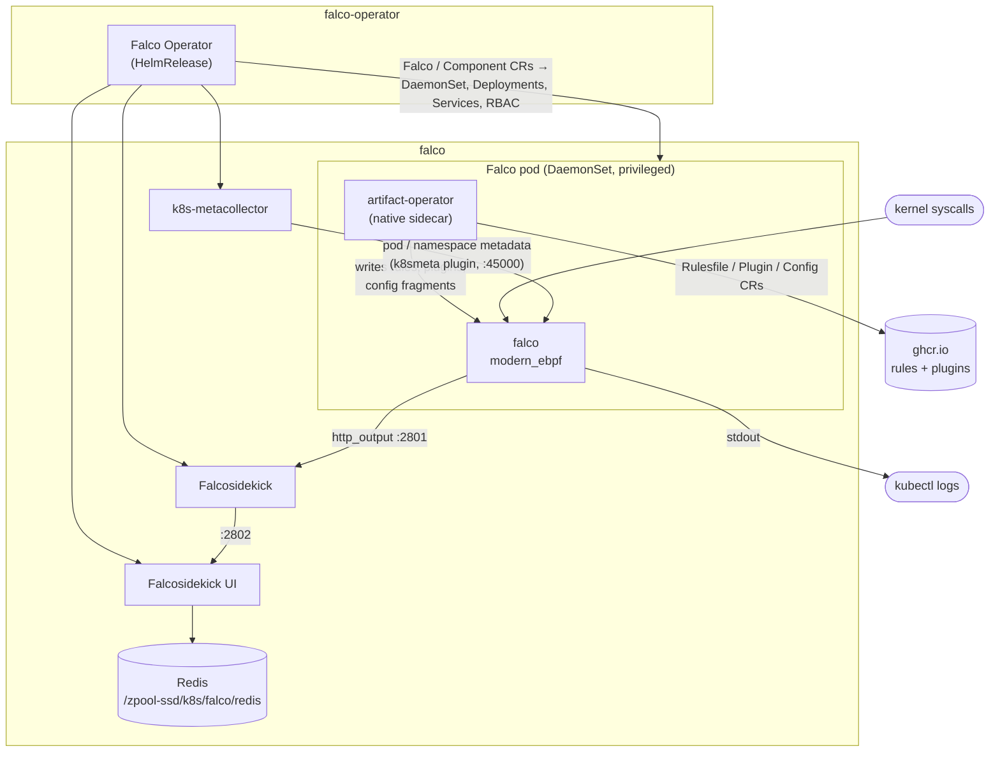

# Falco

Runtime security for the node. Falco watches every syscall through eBPF, matches it
against detection rules (shell in a container, reads of `/etc/shadow`, unexpected
outbound connections, ...) and raises an event. Events go to Falcosidekick, which
fans them out. Today the only target is the web UI at `falco.codesugar.mx`.

Everything is installed and configured by the [Falco Operator](https://falco.org/docs/setup/operator/),
declared in `infrastructure/flux/falco/`.

## How it works



Two kinds of custom resources drive it:

- **`instance.falcosecurity.dev`**: `Falco` (the DaemonSet) and `Component`
  (metacollector, falcosidekick, falcosidekick-ui). The operator Deployment turns
  them into regular workloads and Services, named after the CR.
- **`artifact.falcosecurity.dev`**: `Rulesfile`, `Plugin` and `Config`. These are
  handled by the `artifact-operator` sidecar inside each Falco pod. It pulls OCI
  artifacts from ghcr.io, writes them into Falco's filesystem and Falco hot-reloads.
  `priority` orders rules files and config fragments (higher wins).

## What is configured

`infrastructure/flux/falco/`:

| File | Contents |
|---|---|
| `crds/` | The operator's five CRDs, copied from the chart's `crds/` directory |
| `falco-operator.yaml` | Namespace `falco-operator`, `HelmRepository` falcosecurity, `HelmRelease` falco-operator |
| `falco.yaml` | Everything in namespace `falco`: the Falco instance, rules, plugins, config, components, Redis and the UI's routing and auth |

Versions are pinned everywhere; nothing uses `latest`:

| Piece | Version | Where |
|---|---|---|
| Falco Operator (chart) | 0.4.1 (0.3.1) | `falco-operator.yaml` |
| Falco | 0.44.1 | `Falco.spec.version` |
| falco-rules | 5.2.0 | `Rulesfile/falco-rules` |
| container plugin | 0.7.5 | `Plugin/container` |
| k8smeta plugin | 0.4.2 | `Plugin/k8smeta` |
| k8s-metacollector | 0.1.2 | `Component/metacollector` |
| Falcosidekick | 2.32.0 | `Component/falcosidekick` |
| Falcosidekick UI | 2.2.0 | `Component/falcosidekick-ui` |
| Redis (redis-stack) | 7.2.0-v11 | `Deployment/falcosidekick-ui-redis` |

Notes on choices that differ from the upstream quickstart:

- **CRDs are committed, the HelmRelease uses `crds: Skip`.** There is a single
  `home-platform` Kustomization; if the CRDs came from the chart, the first apply
  would fail on the `Falco`/`Plugin`/... objects before helm-controller had installed
  them. Same approach as Envoy Gateway.
- **`excludedLabels: [kustomize.toolkit.fluxcd.io/*, helm.toolkit.fluxcd.io/*]`.**
  The operator copies a CR's labels onto what it generates. The generated
  ClusterRole/ClusterRoleBinding can't carry an OwnerReference, so with Flux's labels
  they would look Flux-owned without being in its inventory.
- **Redis is a Deployment on a ZFS hostPath** (`strategy: Recreate`) instead of a
  StatefulSet with a PVC, like the other apps. It must stay named
  `falcosidekick-ui-redis`: that's the address the operator hardcodes into the UI
  (and its `wait-redis` init container).
- **`FALCOSIDEKICK_UI_TTL: 30d`.** The UI's default is no expiry, so Redis would grow
  forever.
- **Single replicas** for sidekick and UI (the quickstart uses 2); it's one node.
- **Falco writes to stdout too**, so events are visible with `kubectl logs` even when
  sidekick is down.

## Access to the UI

`falco.codesugar.mx` is LAN-only (not in `lan-only-policy`'s public list) and behind
Authelia with the same forward-auth setup as `whoami-private` (see
[k8s-auth.md](k8s-auth.md)):

1. `HTTPRoute/falcosidekick-ui-ls` on main-gateway sends the host to `envoy-internal`.
2. `HTTPRoute/falcosidekick-ui` on internal-gateway sends it to the UI Service,
   with `SecurityPolicy/authelia-extauthz` checking every request against Authelia.
   Unlike `whoami-private`, it uses Authelia's cookie-only endpoint
   `/api/authz/ext-authz-cookie/`, which ignores the `Authorization` header (see
   Troubleshooting: the UI sends a dummy basic-auth header that Authelia would reject).
   `HTTPRoute/falcosidekick-ui-public` sends only `/manifest.json` and
   `/img/icons/` to the UI without the policy. Browsers fetch the PWA manifest
   without cookies, so behind Authelia it would always be redirected and fail CORS.
3. `ReferenceGrant`s: namespace `falco` is in `allow-routes-to-envoy-internal`
   (`envoy-gateway.yaml`), and `falco-securitypolicy-to-authelia` lives in `auth`.
4. An Authelia `access_control` rule limits the host to the `ldap-k8s-admin` group
   (two-factor), the same audience as the Flux web UI. Everyone else gets denied.

**Why not OIDC like the Flux UI.** Falcosidekick UI has no OIDC or SSO support. Its
own auth is a single shared `user:password` (default `admin:admin`), and the check
accepts empty credentials, so it is turned off (`FALCOSIDEKICK_UI_DISABLEAUTH=true`)
and Authelia does the job instead. Because the UI now trusts anything that reaches
it, `CiliumNetworkPolicy/allow-falcosidekick-ui-ingress` only lets in the
internal-gateway Envoy pods and falcosidekick. Any other pod in the cluster is dropped.
Keep that policy if you touch the UI's exposure.

## Installing

Once, on the host, before pushing:

```bash
mkdir -p /zpool-ssd/k8s/falco/redis
```

Authelia reads its configuration only at startup, so after the commit that adds the
`falco.codesugar.mx` access rule is reconciled:

```bash
kubectl -n auth rollout restart deploy/authelia
```

Until then Authelia applies `default_policy` to the host, so any two-factor user can
get in.

Falco's `modern_ebpf` driver needs kernel ≥ 5.8 with BTF, which the node's Debian
kernel has. Nothing is compiled or downloaded on the host.

## Verifying

```bash
# operator and CRs
kubectl -n falco-operator get helmrelease,pods
kubectl -n falco get falco,components,plugins,rulesfiles,configs
kubectl -n falco get pods        # falco-xxxxx 2/2, metacollector, falcosidekick, falcosidekick-ui, redis

# rules and plugins loaded
kubectl -n falco logs ds/falco -c falco | grep -iE "loading|loaded|plugin"

# trigger a test event ("Read sensitive file untrusted")
kubectl run falco-test --rm -it --restart=Never --image=alpine -- cat /etc/shadow
kubectl -n falco logs ds/falco -c falco | grep -i "sensitive file"
kubectl -n falco logs deploy/falcosidekick | grep -i webui    # "WebUI - POST OK (200)"

# UI auth path
kubectl -n falco get securitypolicy authelia-extauthz -o jsonpath='{.status..conditions[*].message}'
curl -sI https://falco.codesugar.mx | grep -i location        # → auth.codesugar.mx/?rd=...
```

The event should then appear on the UI's Events page.

## Day-to-day

### Adding outputs (ntfy, Slack, Loki, ...)

Falcosidekick is configured with environment variables. Add them to the
`falcosidekick` container in `Component/falcosidekick`; anything secret goes in a
Secret created out-of-band and referenced with `valueFrom.secretKeyRef` (put the
`kubectl create secret` command in a comment, as elsewhere). The list of outputs and
variables is in the [falcosidekick README](https://github.com/falcosecurity/falcosidekick#outputs).
`MINIMUMPRIORITY` per output (e.g. `SLACK_MINIMUMPRIORITY=warning`) keeps noise down.

### Custom rules and exceptions

Add a `Rulesfile` with `inlineRules` (structured YAML, not a string) or a
`configMapRef`, with a higher `priority` than `falco-rules` (50) so it loads after,
and can override or append to, the official rules. `Rulesfile/local-rules` in
`falco.yaml` is where the current exceptions live; add to it rather than creating
another. Scope each exception to the fields shown in the alert (image repository +
`proc.exepath` is better than a whole namespace). The pattern:

```yaml
  inlineRules:
  - rule: Drop and execute new binary in container
    exceptions:
    - name: forgejo_chowned_binary
      fields: [container.image.repository, proc.exepath]
      values:
      - [codeberg.org/forgejo/forgejo, /app/gitea/gitea]
    override:
      exceptions: append
```

Current exceptions:

| Rule | Exception | Why |
|---|---|---|
| Drop and execute new binary in container | Forgejo image running `/app/gitea/gitea` | The entrypoint chowns `/app/gitea` at startup, copying the binary into the overlay upper layer; fires on every git-over-SSH operation |
| Drop and execute new binary in container | code-server image in namespace `code-server` | Dev box with tools installed at runtime; accepted blind spot |
| Redirect STDOUT/STDIN to Network Connection in Container | Forgejo image, `sshd` / `sshd-session` | OpenSSH connects session stdio to the socket; was ~93% of events |
| Contact K8S API Server From Container | `kubectl` in code-server | Its ServiceAccount is cluster read-only by design |

### Tuning Falco config

Add a `Config` with a `priority` above 60 (`falco-output`). It is merged over
Falco's defaults, e.g. `engine.modern_ebpf.buf_size_preset` or
`priority: warning` to drop lower-priority events.

## Upgrading

- **Operator**: bump the chart `version` in `falco-operator.yaml` and copy the CRDs
  from the same chart version in the same commit:

  ```bash
  helm pull falco-operator --repo https://falcosecurity.github.io/charts \
    --version X.Y.Z --untar
  cp falco-operator/crds/*.yaml infrastructure/flux/falco/crds/
  ```

  The operator's defaults for component images move with it (see its
  `docs/version-matrix.md`), but only matter for fields not pinned here.
- **Falco, components**: bump `spec.version` / `spec.component.version`.
- **Rules, plugins**: bump the `ociArtifact.image.tag`. Tags live under
  `ghcr.io/falcosecurity/rules/falco-rules` and `ghcr.io/falcosecurity/plugins/plugin/<name>`.
  A new major rules version can require a newer Falco; check the rules release notes.

## Uninstalling

Order matters. The artifact CRs carry finalizers that the sidecar in the Falco pod
removes; if the Falco pod goes first they hang. So don't just delete the folder in
one commit:

1. Commit removing the `Rulesfile`, `Plugin` and `Config` objects; wait for reconcile.
2. Commit removing the rest of `falco.yaml`; then `falco-operator.yaml` and `crds/`.
3. Remove `falco` from `allow-routes-to-envoy-internal` and the `falco.codesugar.mx`
   rules from `authelia.yaml`.

If something is stuck in `Terminating`:

```bash
kubectl -n falco patch <kind>/<name> --type merge -p '{"metadata":{"finalizers":null}}'
```

## Troubleshooting

```bash
kubectl -n falco-operator logs deploy/falco-operator -f
kubectl -n falco logs ds/falco -c artifact-operator -f
kubectl -n falco logs ds/falco -c falco -f
```

**Falco pod stuck in `Init`/restarting, artifact-operator logs pull errors**: ghcr.io
unreachable or a wrong tag. `kubectl -n falco describe plugin <name>` shows the status
conditions.

**Rules fail to load (`LOAD_ERR_...` in Falco's log)**: usually rules needing a plugin
field that isn't loaded (`container.*` needs the container plugin) or a rules version
newer than Falco supports.

**`Falco internal: hot restart failure: Plugin requirement not satisfied, must load
one of: container`** (Critical) right after the Falco pod starts: the artifact
sidecar writes plugin configs one by one and sends SIGHUP; a restart that happens
before the container plugin's fragment is written fails to load the rules. Harmless
if a later restart logs `Loaded plugin 'container@...'` followed by `Opening 'syscall'
source`; only a problem if it's the last thing in the log.

**`k8smeta` fields empty / plugin can't connect**: check the metacollector pod is
running and `metacollector.falco.svc:45000` resolves.

**UI pod stuck in `Init:0/1`**: the `wait-redis` init container can't reach
`falcosidekick-ui-redis:6379`. Check the Redis pod; a missing
`/zpool-ssd/k8s/falco/redis` directory leaves it in `ContainerCreating`.

**UI shows no events**: `kubectl -n falco logs deploy/falcosidekick` should show
`WebUI - POST OK`. A timeout there means the network policy is blocking sidekick
(check the `app.kubernetes.io/name` label still matches).

**Browser pops a native username/password dialog**: the UI's frontend calls its own
API with `Authorization: Basic anonymous:anonymous` to detect that its login is
disabled. Envoy always forwards `Authorization` to ext-authz (leaving it out of
`headersToExtAuth` doesn't help), and Authelia's default `ext-authz` endpoint tries
those credentials against LLDAP (`username=anonymous` in its log, ~2s `401
ext_authz_denied` in Envoy's access log) and answers `WWW-Authenticate: Basic`. The
`SecurityPolicy` must use `/api/authz/ext-authz-cookie/`, which only looks at the
session cookie. If it already does, check Authelia was restarted after the endpoint
was added to its config. (This also means curl with `-u` basic auth doesn't work for
this host.)

**`https://falco.codesugar.mx` returns `403` after logging in**: the user isn't in
`ldap-k8s-admin`. `500` / `RefNotPermitted`: namespace `falco` missing from
`allow-routes-to-envoy-internal`. Other auth problems: see [k8s-auth.md](k8s-auth.md#troubleshooting).
