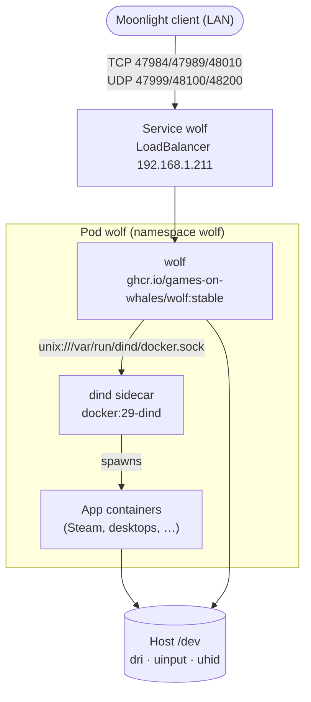

# Wolf (Games on Whales)

[Wolf](https://games-on-whales.github.io/wolf/stable/user/quickstart.html) streams games and
virtual desktops to [Moonlight](https://moonlight-stream.org/) clients. Each app runs as its
own Docker container with the GPU (AMD Radeon 890M, `/dev/dri/renderD128`) attached.
The manifest is `infrastructure/flux/apps/wolf.yaml`.

## How it works



### Why Docker-in-Docker

Wolf starts apps by talking to a Docker daemon (`WOLF_DOCKER_SOCKET`). The node runs
containerd and has no `docker.sock`, so a privileged `docker:dind` native sidecar
(an init container with `restartPolicy: Always`) provides one. Its startup probe
(`docker info`) holds Wolf back until the daemon answers.

Wolf hands Docker **paths as it sees them** for the app containers' bind mounts, so the
paths must mean the same thing inside both containers. Both mount these at the same place:

| Path | Source | Contents |
|---|---|---|
| `/etc/wolf` | `/zpool-ssd/k8s/wolf/etc` | `cfg/config.toml`, pairing keys/certs, per-app home dirs, `fake-udev` |
| `/tmp/sockets` | `emptyDir` | Wayland / PulseAudio sockets (`XDG_RUNTIME_DIR`) |
| `/var/run/wolf` | `emptyDir` | Wolf API socket (`WOLF_SOCKET_PATH`), bind-mounted into the Wolf UI app |
| `/dev` | host `/dev` | GPU, and the virtual input devices Wolf creates at runtime |
| `/run/udev` | host `/run/udev` | udev database for the virtual input devices |

The sidecar also keeps its image/layer storage at `/zpool-ssd/k8s/wolf/docker`, because
game images are large and should survive restarts.

### Why not hostNetwork

The quickstart uses `--network=host`. Here that would make dockerd create its bridge and
iptables rules in the host network namespace, next to Cilium's. The pod uses the pod
network instead, so Docker's rules stay inside the pod's netns.

### Why a LoadBalancer and not main-gateway

Moonlight uses its own protocol over TCP and UDP, which main-gateway (HTTP/HTTPS) can't
route. The `wolf` Service is a `LoadBalancer` with a fixed IP from Cilium LB IPAM
(`lbipam.cilium.io/ips: "192.168.1.211"`), announced with L2 like main-gateway.
`externalTrafficPolicy: Local` keeps the client's real IP, which Wolf uses to tell
streaming sessions apart.

`lan-only-policy` doesn't apply here (it only covers the gateway's `reserved:ingress`
identity). The service is reachable only from the LAN unless the router forwards
these ports.

| Port | Protocol | Use |
|---|---|---|
| 47984 | TCP | HTTPS (pairing, app list) |
| 47989 | TCP | HTTP (pairing, PIN page) |
| 48010 | TCP | RTSP setup |
| 47999 | UDP | Control |
| 48100 | UDP | Video |
| 48200 | UDP | Audio |

## Host prerequisites

Run once on the node before the manifest is deployed:

```bash
# hostPath volumes use type: Directory, so they must already exist
mkdir -p /zpool-ssd/k8s/wolf/etc /zpool-ssd/k8s/wolf/docker

# udev rules for the virtual gamepads/keyboards/mice Wolf creates
curl -fsSL https://raw.githubusercontent.com/games-on-whales/wolf/stable/85-wolf.rules \
  -o /etc/udev/rules.d/85-wolf.rules
udevadm control --reload-rules && udevadm trigger

# /dev/uinput must exist
ls -la /dev/uinput
```

## Pairing a client

1. In Moonlight, add the host manually as `192.168.1.211`. mDNS discovery doesn't
   pass through the LoadBalancer, so the server won't appear automatically.
2. Moonlight shows a PIN. Wolf logs a URL for entering it:

   ```bash
   kubectl -n wolf logs deploy/wolf -c wolf | grep pin
   # Insert pin at http://10.0.0.205:47989/pin/#A299805F523FBA6C
   ```

3. The logged IP is the **pod IP**, which only works inside the cluster. Swap it for the
   LoadBalancer IP and keep the rest of the URL:

   ```
   http://192.168.1.211:47989/pin/#A299805F523FBA6C
   ```

   Open it from a machine on the LAN and enter the PIN. No port forward is needed.

If `192.168.1.211` doesn't answer, check that the Service got its IP
(`kubectl -n wolf get svc wolf`, column `EXTERNAL-IP`). As a fallback for the PIN page only,
`kubectl -n wolf port-forward deploy/wolf 47989:47989` and open
`http://localhost:47989/pin/#<id>`. Streaming itself needs UDP, which port-forward can't carry.

## Troubleshooting

```bash
kubectl -n wolf get pods,svc
kubectl -n wolf logs deploy/wolf -c wolf     # Wolf: pairing, sessions, GPU/encoder errors
kubectl -n wolf logs deploy/wolf -c dind     # Docker daemon: image pulls, container starts
kubectl -n wolf exec deploy/wolf -c dind -- docker ps -a   # app containers Wolf launched
```

- **Wolf can't reach Docker:** check the `dind` startup probe and that both containers
  mount the `docker-socket` volume at `/var/run/dind`.
- **App container fails on a bind mount:** a path Wolf passed doesn't exist in `dind`;
  both containers must mount it at the same path (table above).
- **Wolf UI starts and exits within a second:** it can't reach Wolf's API. The default
  `config.toml` mounts `/var/run/wolf/wolf.sock` into the UI container, so Wolf needs
  `WOLF_SOCKET_PATH=/var/run/wolf/wolf.sock` and both containers need `/var/run/wolf`.
  If the path is missing in `dind`, Docker creates an empty directory there instead.
- **No GPU encoding:** confirm `/dev/dri/renderD128` is the 890M on the host
  (`ls -l /dev/dri/by-path/`) and adjust `WOLF_RENDER_NODE` if not.
- **Falco alerts:** both containers are privileged and mount host `/dev`, which Falco's
  default rules flag. That's expected for this workload.

## Later: Kubernetes-native apps

This setup runs apps in Docker inside the pod. Games on Whales'
[Fenrir](https://github.com/games-on-whales/fenrir) runs Wolf sessions as Kubernetes
resources instead, if that's ever worth the switch.
